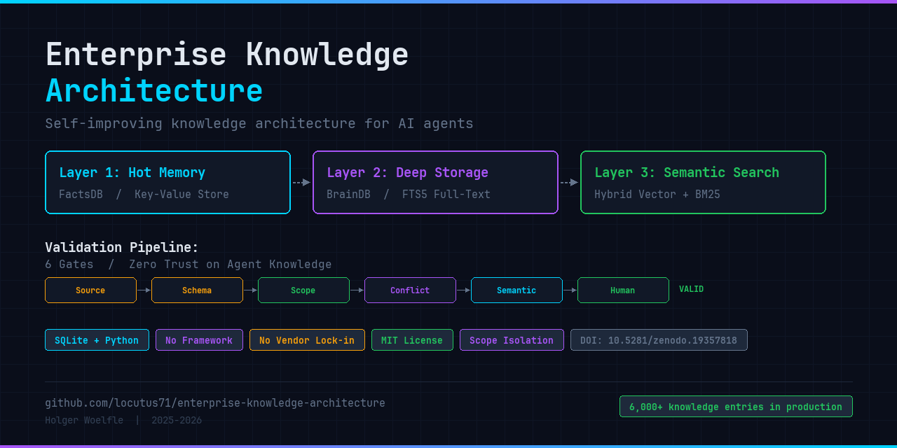

# Enterprise Knowledge Architecture



[](https://doi.org/10.5281/zenodo.19357818)
[](https://opensource.org/licenses/MIT)

A self-improving knowledge architecture for AI agents. 3 memory layers, hybrid search, automated validation, multi-LLM orchestration. No framework, no vendor lock-in. SQLite, Python, open-source models.

**Paper:** [Epistemic Validation in AI Knowledge Systems](https://zenodo.org/records/19357818) (Zenodo, 2026) — DOI: 10.5281/zenodo.19357818

## Quick Start

```bash
git clone https://github.com/locutus71/enterprise-knowledge-architecture.git
cd enterprise-knowledge-architecture

# Explore the interactive architecture documentation
# (open in any browser)
open deep-dive.html        # macOS
xdg-open deep-dive.html   # Linux
start deep-dive.html       # Windows
```

Each component in `architecture/` is a standalone document. Start with the overview table below, then dive into what interests you.

## Architecture Overview

| Component | Description | Document |
|---|---|---|
| 3-Layer Memory | Hot Memory, Deep Storage, Semantic Search | [architecture/3-layer-memory.md](architecture/3-layer-memory.md) |
| Hybrid Search | 70% Vector + 30% BM25, Temporal Decay | [architecture/hybrid-search.md](architecture/hybrid-search.md) |
| Hook System | 5-stage Session Lifecycle | [architecture/hook-system.md](architecture/hook-system.md) |
| Validation Layer | 7 Gates, Zero Trust on Agent Knowledge | [architecture/validation-layer.md](architecture/validation-layer.md) |
| Knowledge Loop | Self-Improving Knowledge Cycle | [architecture/knowledge-loop.md](architecture/knowledge-loop.md) |
| Multi-LLM | Auto-Router, Cross-LLM Benchmarking | [architecture/multi-llm-orchestration.md](architecture/multi-llm-orchestration.md) |
| Scope Isolation | Data Separation with Cross-Scope Coach | [architecture/scope-isolation.md](architecture/scope-isolation.md) |
| Timestamp Hook | Time Awareness for AI Agents | [architecture/timestamp-hook.md](architecture/timestamp-hook.md) |
| Incremental Extraction | PreCompact hook saves knowledge before context loss | [architecture/incremental-extraction.md](architecture/incremental-extraction.md) |
| Dual Decay | Usage-based decay complements time-based decay | [architecture/dual-decay.md](architecture/dual-decay.md) |

## Interactive Documentation

- [deep-dive.html](deep-dive.html) — Full interactive architecture documentation (open in browser)

## Lessons Learned

- [architecture/lessons-learned.md](architecture/lessons-learned.md) — What went wrong and what we learned

## Why This Exists

Most AI agent frameworks treat memory as an afterthought — a vector database bolted on. This architecture treats knowledge as a first-class concern: validated before storage, scoped to prevent data leaks, and self-improving through feedback loops.

Built in production use across 6,700+ knowledge entries over 4 months. The lessons learned document covers real failures, not hypothetical ones.

## Priority Declaration

See [PRIORITY.md](PRIORITY.md) for authorship and public evidence.

## Contributing

This is an architecture reference, not a framework. If you're building something similar and want to share what worked (or didn't), open an issue.

## License

MIT License. See [LICENSE](LICENSE).

## Latest Findings (April 2026)

**Incremental Knowledge Extraction:** The system loses knowledge not just through time decay, but through context compression during long sessions. A PreCompact hook fires automatically before each compression, extracting facts, relations, and project state. The system saves itself before it forgets.

**Dual Decay:** Pure time-based temporal decay (exponential, 90-day half-life) causes rarely edited but recently retrieved projects to disappear. Solution: `final_decay = max(time_decay, usage_decay)`. Usage beats age.

**Synthetic Test Harness:** A unified test framework with synthetic documents and controlled ground truth. Enables parameter sweeps (hybrid weighting, BM25, decay) using Bayesian optimization instead of brute-force grid search. Metrics: MRR, Recall@5, latency p95/p99.

---
Author: Holger Woelfle | 2025-2026
